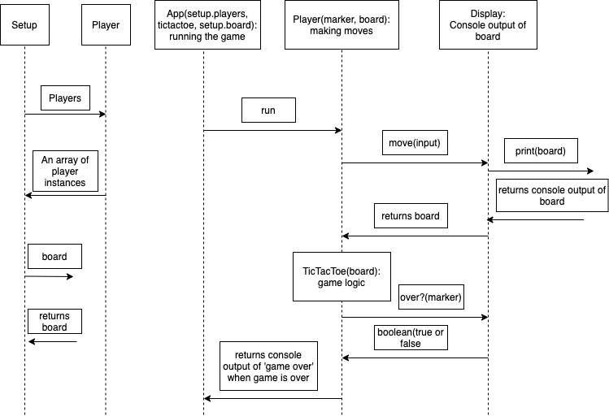

# Tic Tac Toe Tech Test

I worked my way through a command line app version of the tic tac toe tech test. The brief is given below.

## The brief

The rules of tic-tac-toe are as follows:

* There are two players in the game (X and O)
* Players take turns until the game is over
* A player can claim a field if it is not already taken
* A turn ends when a player claims a field
* A player wins if they claim all the fields in a row, column or diagonal
* A game is over if a player wins
* A game is over when all fields are taken

Build the business logic for a game of tic tac toe. It should be easy to implement a working game of tic tac toe by combining your code with any user interface, whether web or command line.

## Running the app

```
$ git clone
$ bundle install
$ bundle exec rspec
$ ruby app_runner.rb
```

## Project Considerations

* See diagram below for modelling the app
* Tested with rspec
* Focus on OOD and TDD principles

## Classes: Responsibilities

* App: setting up the game by instantiating the players and  creating the board
* TicTacToe: intialised with the players and the board. Runs the game via a while loop
* Player: initialised with its marker and the board. Makes moves via user input and checks to see if it has won.
* Display: console output of board

## Diagram




SRP: Display shows single responsibility principle: its only responsible for console outputting a nested array. However unsure about player as its responsible for both moving and checking to see if its won?
open closed principle: i don’t think any of my classes show this as all would have to be modified to add new functionality. Not too sure how you go about implementing this one.
Liskov substituion principle: I’m assuming this is about inheritance. Not applied and can’t see where inheritance could be applied.
Interface segregation: classes are quite separated. You could change player and wouldnt have to change another class. I believe this applies to all of them.
