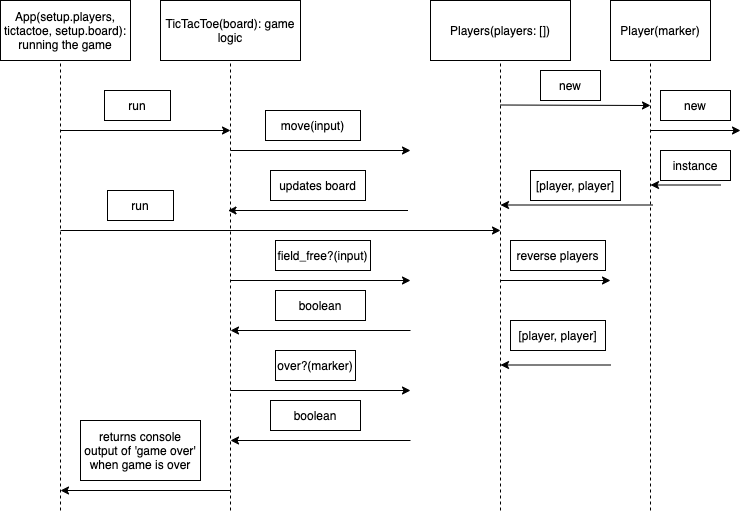

# Tic Tac Toe Tech Test

I worked my way through a command line app version of the tic tac toe tech test. The brief is given below.

## The brief

The rules of tic-tac-toe are as follows:

* There are two players in the game (X and O)
* Players take turns until the game is over
* A player can claim a field if it is not already taken
* A turn ends when a player claims a field
* A player wins if they claim all the fields in a row, column or diagonal
* A game is over if a player wins
* A game is over when all fields are taken

Build the business logic for a game of tic tac toe. It should be easy to implement a working game of tic tac toe by combining your code with any user interface, whether web or command line.

## Running the app

```
$ git clone
$ bundle install
$ bundle exec rspec
$ ruby app_runner.rb
```

## Project Considerations

* See diagram below for modelling the app
* Tested with rspec
* Focus on OOD and TDD principles

## Diagram


